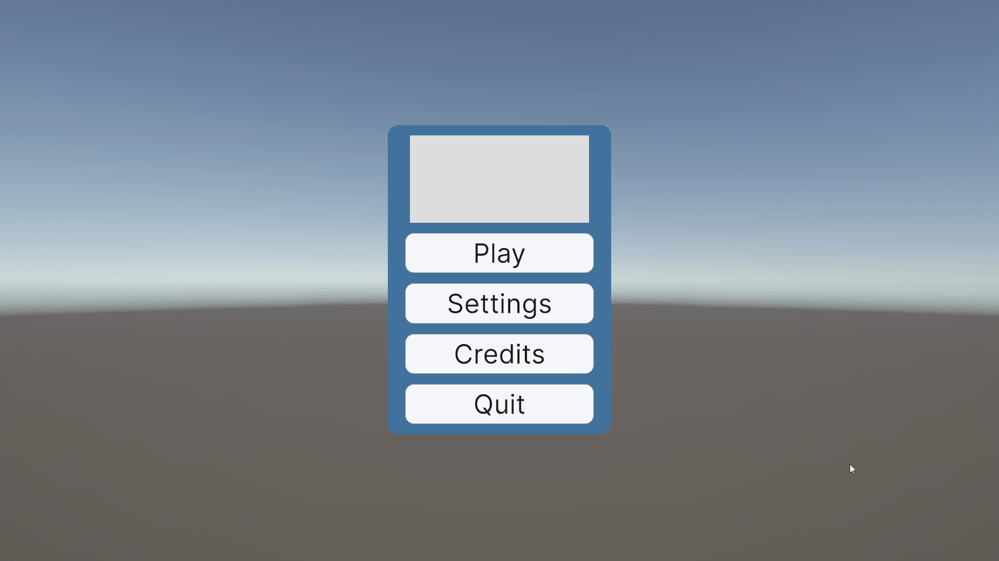
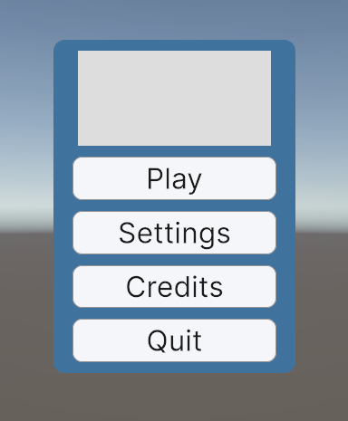
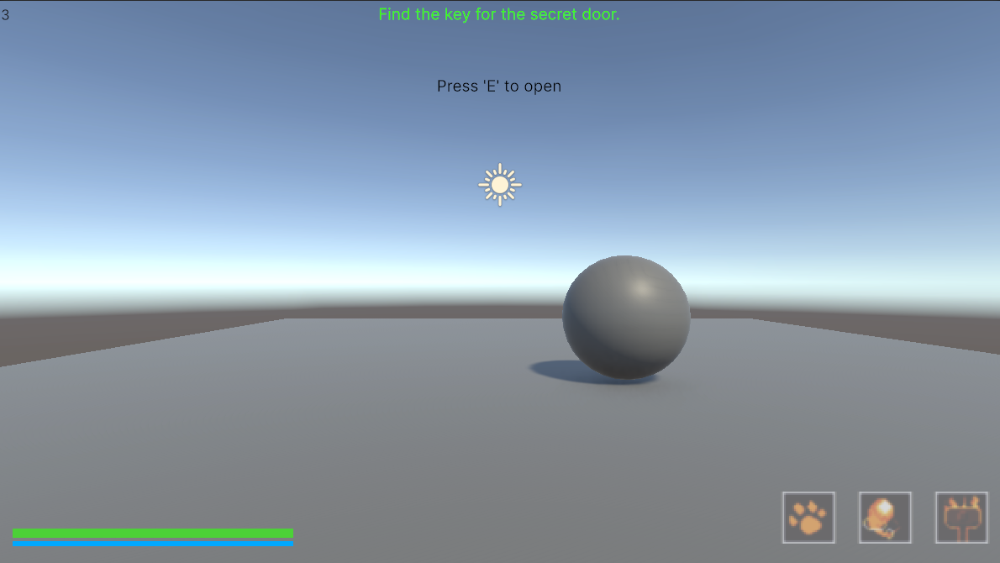
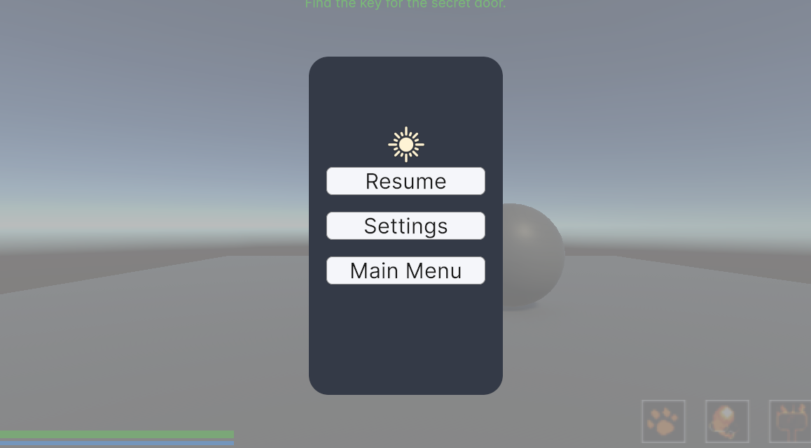
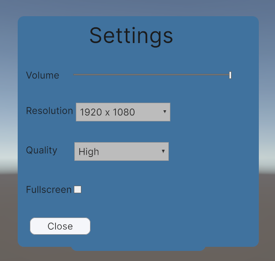

# UI Toolkit Framework

A modular, event-driven UI framework built in **Unity** using **UI Toolkit**. This project explores how to design scalable game UI through clean architecture, reusable components, and a clear separation between gameplay systems and presentation.

---

## Overview

The goal of this project was to learn Unity's UI Toolkit while focusing on software architecture rather than simply recreating menus.

The project demonstrates how gameplay systems can communicate with the UI through an event-driven approach, allowing the interface to remain independent from gameplay logic. The UI is built using reusable view components, with a central controller responsible for coordinating updates.

---

## Features

### Main Menu
- Scene loading
- Animated transitions
- Responsive layout

### Pause Menu
- Pause and resume functionality
- Access to shared settings menu
- Animated opening and closing transitions

### Settings
- Functional audio controls
- Shared between the main menu and pause menu
- Responsive layout

### HUD
- Animated health bar
- Delayed damage bar
- Stamina bar
- Ability cooldown indicators
- Current objective display
- Context-sensitive interaction prompts

### Polish
- Consistent colour palette
- UI transitions and animations
- Button hover and press feedback
- Scene transitions
- Responsive layouts
- UI sound effects

---

# Architecture

The project follows an event-driven architecture that separates gameplay logic from presentation.

Gameplay systems own the data while the UI is responsible only for displaying it.

```
Player Input
      │
      ▼
Character Data
      │
      │ Events
      ▼
HUD Controller
      │
      ▼
Individual UI Views
```

The HUD Controller acts as the bridge between gameplay systems and the user interface. It listens for gameplay events and forwards updated values to the relevant UI components.

Each individual view has a single responsibility and is only concerned with displaying information.

---

## Architecture Diagram

> Replace this section with the architecture diagram.


---

# Data Flow

A typical update follows the sequence below.

```
Player Input

↓

Gameplay changes Character Data

↓

Character Data raises an event

↓

HUD Controller receives updated data

↓

Relevant View updates itself

↓

UI redraws
```

For example, taking damage follows this process.

```
Player Takes Damage

↓

CharacterData updates Health

↓

OnHealthChanged event

↓

HUDController receives updated health percentage

↓

HealthBarView updates

↓

Damage bar animates towards the new value
```

Because updates are event-driven, the UI performs no unnecessary polling each frame.

---

# Project Structure

```
Assets
│
├── Scripts
│   ├── Gameplay
│   │   ├── CharacterData
│   │   ├── AbilitySystem
│   │   └── PlayerInputHandler
│   │
│   └── UI
│       ├── Controllers
│       │   └── HUDController
│       │
│       ├── Views
│       │   ├── HealthBarView
│       │   ├── StaminaBarView
│       │   ├── AbilityBarView
│       │   ├── PromptView
│       │   └── ObjectiveView
│       │
│       ├── UXML
│       ├── USS
│       └── Assets
│
└── Scenes
```

---

# Design Decisions

## Event-Driven UI

The UI does not poll gameplay values every frame.

Instead, gameplay systems raise events whenever data changes, allowing the UI to update only when necessary.

### Benefits

- Reduced unnecessary updates
- Lower coupling between gameplay and UI
- Easier debugging
- Improved scalability
- Easier to extend with additional UI components

---

## Separation of Concerns

Gameplay systems never reference UI elements directly.

Likewise, UI components never contain gameplay logic.

The HUD Controller acts as the communication layer between gameplay and presentation.

This makes the interface easier to maintain and allows gameplay systems to evolve independently of the UI.

---

## Reusable Components

Rather than creating one large HUD class, the interface is split into individual view components.

Examples include:

- HealthBarView
- StaminaBarView
- AbilityBarView
- PromptView
- ObjectiveView

Each component is responsible for displaying a single piece of information.

---

## Responsive Layout

The interface uses UI Toolkit's Flexbox layout system to automatically adapt to different resolutions and aspect ratios without requiring multiple UI layouts.

---

# Technologies

- Unity
- C#
- UI Toolkit
- UXML
- USS
- Unity Input System

---

# Skills Demonstrated

- UI Toolkit
- Event-driven programming
- Software architecture
- Separation of concerns
- Modular UI design
- Responsive interface design
- UI animation
- Reusable component development
- C# programming

---

# What I Learned

This project significantly improved my understanding of designing maintainable UI systems for games.

Key areas of learning included:

- Structuring UI using reusable components.
- Designing event-driven interfaces.
- Separating gameplay logic from presentation.
- Building responsive layouts using UI Toolkit.
- Creating smooth UI animations and transitions.
- Refactoring towards a cleaner, more scalable architecture.

One of the most valuable lessons was recognising how architectural decisions affect future development. Refactoring the HUD into individual view components made it significantly easier to implement additional features, such as the delayed damage bar animation, without introducing unnecessary complexity.

---

# Challenges & Solutions

### Challenge
The original HUD was implemented as a single class responsible for updating every UI element.

### Solution
The HUD was refactored into a controller with individual view components. Gameplay systems now communicate through events, allowing each view to update independently while keeping gameplay logic completely separate from presentation.

### Result
The refactored architecture simplified future development and made features such as the delayed damage bar animation significantly easier to implement.

---

# Future Improvements

Potential future additions include:

- Theme switching
- Save and load of user settings
- Localisation support
- Accessibility improvements
- Additional reusable UI components
- Expanded controller navigation

---

## Demo

*(Add a GIF or short video showcasing the project.)*



---

## Screenshots

| Main Menu | HUD |
|-----------|-----|
|  |  |

| Pause Menu | Settings |
|------------|----------|
|  |  |

---

## Author

**Jonathan Andrews**

Computer Science (Games Development) Graduate

Interested in gameplay programming, AI systems, software architecture and game systems engineering.