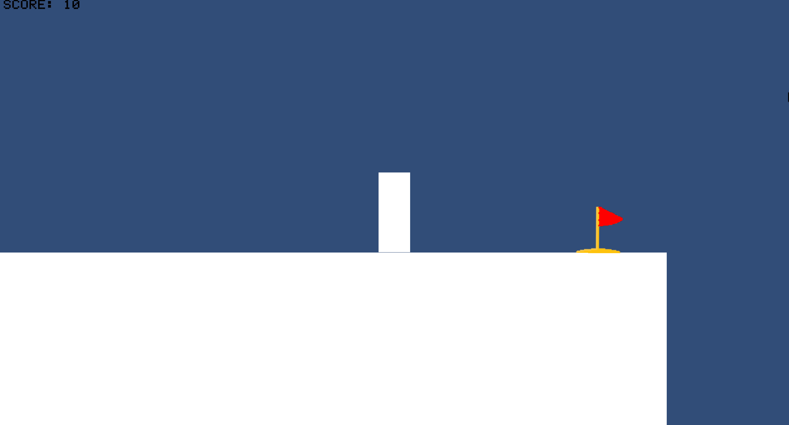
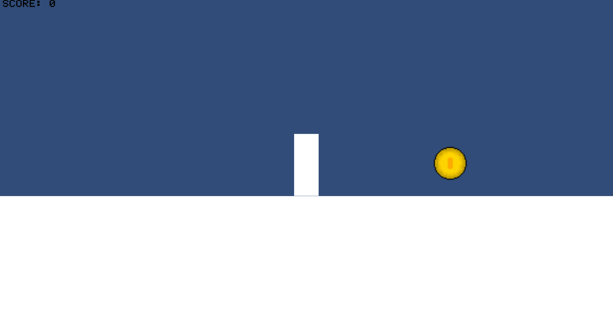

# 03_Platformer

This folder contains a **small 2D platformer project** in Unity, showcasing core platforming mechanics, interactive objects, and basic UI systems.

---

## 🕹️ Unity: 2D Platformer

### 🧠 Overview

A simple 2D platformer demonstrating:

- Player movement with jumping and basic physics  
- **Moving platforms** to navigate the level  
- **Checkpoints** for respawning  
- **Collectables** to interact with  
- Basic **UI** to display score/collected items  

This project highlights **level design**, **player-environment interaction**, and **UI integration**.

### 🚀 Features

- Player movement (jump, walk)  
- Moving platforms  
- Checkpoints system  
- Collectable items  
- UI for score and progress  
- Physics-based interactions

### 🎮 Controls

| Action      | Key |
|-------------|-----|
| Move        | Arrow Keys / A,D |
| Jump        | Space |
| Respawn     | R |

### 📦 Build

**Download:**  
👉[Unity 2D Platformer Build](./2D_Platformer_Windows.zip)

### 📸 GIFs

---

## 🛠️ Technologies Used

- Unity 2D Engine  
- C# scripting for player and platform mechanics  
- Physics-based interactions  
- UI system for score and collectables  
- Basic level design and checkpoints  

---

## 📌 Notes

- Screenshots/GIFs should demonstrate each key mechanic.  
- Ensure the zipped build contains all required files for proper functionality.  
