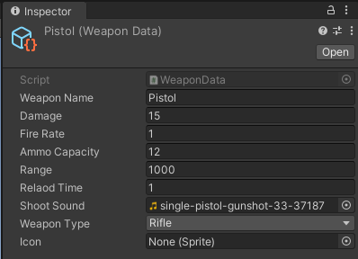

# 04_Systems

This folder contains projects demonstrating **reusable systems and architecture** in both Unity and Unreal Engine. These projects highlight modular design, data-driven development, and efficient runtime systems.

---

## 🕹️ Unity: Reusable Weapon System

### 🧠 Overview

A Unity project showcasing a **reusable weapon system** using **Scriptable Objects**. Features:

- Modular weapon types with configurable stats  
- Easy creation of new weapons without coding  
- Dynamic weapon switching and usage  

This system demonstrates **data-driven design** and **scalable gameplay systems**.

### 🚀 Features

- Scriptable Object-based weapon definitions  
- Configurable stats (damage, fire rate, range, etc.)  
- Modular and reusable for multiple weapon types  
- Player can switch and use weapons dynamically  

### 🎮 Controls

| Action       | Key |
|--------------|-----|
| Move         | WASD / Arrow Keys |
| Jump         | Space |
| Fire Weapon  | Left Mouse Button |
| Switch Weapon| 1, 2, 3 … |

### 📦 Build

**Download:**  
[Unity Weapon System Build](./Builds/Unity_Reusable_Weapons_Windows.zip)

### 📸 Screenshots / GIFs

 

---

## 🕹️ Unreal Engine: Object Pooling & Save/Load System

### 🧠 Overview

An Unreal Engine project demonstrating **efficient runtime systems**:

- **Object Pooling System**: Reuses objects to reduce runtime instantiation costs  
- **Save/Load System**: Saves player data and game state, and loads it reliably  
- **Enhanced Input System**: Player movement integrated from `01_Basics`  

This project emphasizes **performance optimization** and **persistent game data management**.

### 🚀 Features

- Object pooling for reusable actors  
- Save/load game state functionality  
- Player movement using Enhanced Input System  
- Blueprint-based implementation for easy integration  

### 🎮 Controls

| Action      | Key |
|-------------|-----|
| Move        | WASD / Arrow Keys |
| Jump        | Space |
| Sprint      | Left Shift |
| Crouch      | Ctrl |
| Interact    | E |

### 📦 Build

### 📸 Screenshots / GIFs

- `images/unreal-object-pooling.gif` → Object pooling demonstration  
- `images/unreal-save-load.png` → Save/load UI or confirmation  
