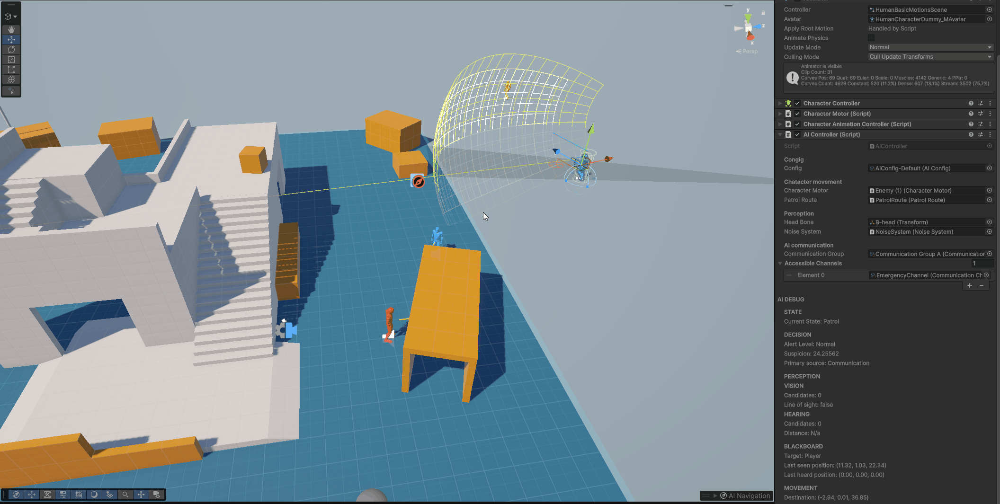

# AI Framework

A modular, data-driven AI framework built in Unity and C# for stealth and gameplay-focused AI.

The project focuses on building reusable AI systems with clear separation of responsibilities, configurable behaviour, debugging tools, and an architecture designed to make future performance optimisation and DOTS/ECS conversion easier.

---

## Showcase

### AI Behaviour

Demonstrates the complete AI behaviour pipeline:

**Patrol → Hear Noise → Investigate → See Player → Alert → Chase → Lose Player → Search → Return to Patrol**

(Media/AIBehaviour2.gif)


### AI Communication

Demonstrates multiple AI agents sharing information through the communication system.




---

## Features

### AI Perception

The perception system allows AI agents to detect their environment through multiple sensory systems.

#### Vision

- Configurable vision range
- Direct field of view
- Peripheral vision
- Line-of-sight checks
- Configurable detection layers
- Separate peripheral and direct vision behaviour
- Scene visualisation through Gizmos

#### Hearing

The hearing system is event-driven and integrated with character animation.

Footsteps generate noise through animation events, with noise intensity scaling based on movement speed.

This means that different movement speeds produce different levels of noise.

```text
Character Animation
        ↓
Footstep Animation Event
        ↓
Noise System
        ↓
Noise Event
        ↓
AI Hearing
        ↓
Suspicion
```

This allows walking, running and other actions to produce different levels of detectable noise without tightly coupling the AI system to the character controller.

---

## Suspicion System

The suspicion system combines information from multiple perception sources into a single AI awareness model.

Suspicion can be generated from:

- Vision
- Hearing
- Communication
- Other future stimulus types

Each source can contribute independently and suspicion gradually decays over time.

```text
Vision ───────────────┐
Hearing ──────────────┤
Communication ────────┤
                      ↓
              Suspicion System
                      ↓
              Suspicion Level
                      ↓
                Alert Level
```

### Alert Levels

The AI uses configurable thresholds to determine its current level of awareness.

| Suspicion | Alert Level |
|---|---|
| Below 30 | Normal |
| 30+ | Suspicious |
| 60+ | Investigating |
| 90+ | Alerted |

This allows perception to remain separate from decision-making.

For example, seeing a player does not directly force the AI into a specific state. Instead, the perception system provides evidence, which increases suspicion and allows the decision system to determine the appropriate behaviour.

---

## Behaviour System

The AI uses a modular state machine to control behaviour.

Current states include:

- Idle
- Patrol
- Suspicious
- Investigate
- Alerted
- Chase
- Search
- Return to Patrol

The state machine is responsible for behaviour while the decision system determines when transitions should occur.

### Example Behaviour Flow

```text
                ┌─────────────┐
                │   Patrol    │
                └──────┬──────┘
                       │
                  Hear Noise
                       ↓
                ┌─────────────┐
                │ Investigate │
                └──────┬──────┘
                       │
                   See Player
                       ↓
                ┌─────────────┐
                │   Alerted   │
                └──────┬──────┘
                       │
                       ↓
                ┌─────────────┐
                │    Chase    │
                └──────┬──────┘
                       │
                 Lose Player
                       ↓
                ┌─────────────┐
                │    Search   │
                └──────┬──────┘
                       │
                  Search Ends
                       ↓
             ┌──────────────────┐
             │ Return to Patrol │
             └──────────────────┘
```

The system is designed so that additional states can be added without requiring changes to the core AI controller.

---

## AI Communication

AI agents can communicate information to other agents within their communication group.

Communication can be used to share information such as:

- Player sightings
- Investigation locations
- Search locations
- Active chase targets
- Other relevant AI information

The communication system uses temporary communication channels when agents need to share information across groups or over a limited period of time.

```text
AI Agent A
    │
    │ Detects Player
    ↓
Communication System
    │
    ↓
Communication Channel
    │
    ├───────────────┐
    ↓               ↓
AI Agent B      AI Agent C
    │               │
    ↓               ↓
Update AI State / Suspicion
```

Communication is kept separate from individual states so that states can request communication without needing to implement the underlying communication logic themselves.

For example:

```text
State
  ↓
Request Communication
  ↓
AI Communication System
  ↓
Communication Channel
  ↓
Other AI Agents
```

This allows the communication system to be reused by multiple AI states.

---

## Data-Driven Design

AI behaviour is configured through ScriptableObjects rather than hard-coded values.

### AIConfig

Contains AI-specific configuration such as:

- Vision range
- Field of view
- Peripheral vision
- Hearing sensitivity
- Suspicion rates
- Suspicion thresholds
- Search radius
- Search duration
- Search waypoint settings
- Chase settings
- Communication-related timing

### MovementConfig

Movement-specific configuration is kept separate from AI behaviour.

This includes values such as:

- Walk speed
- Run speed
- Movement settings
- Turning behaviour
- Other character movement configuration

Separating AI configuration from movement configuration allows the same AI framework to work with different character movement implementations.

---

## Architecture

The project separates AI decision-making from Unity-specific execution.

```text
                    AIController
                         │
          ┌──────────────┼──────────────┐
          ↓              ↓              ↓
     Perception      Blackboard      Decision
          │              │              │
          ↓              ↓              ↓
 Vision / Hearing    AI Data       State Machine
          │                             │
          ↓                             ↓
     Suspicion                     AI States
          │                             │
          └──────────────┬──────────────┘
                         ↓
                    AIMovement
                         │
                         ↓
                 CharacterMotor
                         │
                         ↓
                    Character
```

The system separates:

- Perception
- Suspicion
- AI memory
- Decision-making
- State behaviour
- Movement
- Animation

This makes individual systems easier to test, replace and optimise.

---

## AI Blackboard

The AI Blackboard stores the current information required by the decision-making and state systems.

Examples include:

- Current target
- Last known position
- Last heard position
- Current destination
- Suspicion
- Alert level
- Primary suspicion source
- Search status
- Other temporary AI flags

The Blackboard acts as shared AI state without requiring individual states to directly depend on every other AI system.

```text
Perception
    ↓
Blackboard
    ↓
Decision
    ↓
State
    ↓
Movement
```

---

## Movement Abstraction

The AI does not directly control the `NavMeshAgent`.

Instead, navigation is wrapped by an `AIMovement` layer.

```text
AI State
   ↓
AIMovement
   ↓
NavMeshAgent
```

The `NavMeshAgent` is primarily responsible for navigation and pathfinding, while the character's `CharacterMotor` is responsible for actually moving the character.

This keeps AI behaviour independent from the specific movement implementation.

It also makes the architecture easier to adapt to a different movement system in the future.

---

## Separation of Responsibilities

A major design goal of the project is to avoid putting too much functionality into `MonoBehaviour` components.

Several systems were implemented as regular C# classes where a Unity component was not necessary.

Instead of having every system depend on Inspector references, required data can be passed into systems through their constructors or methods.

This reduces unnecessary components on AI and character GameObjects and keeps the Unity hierarchy easier to understand.

The general approach is:

```text
Unity Components
       ↓
Provide Data / Runtime Context
       ↓
AI Systems
       ↓
AI Logic
```

Unity-specific functionality is kept primarily at the edges of the system.

This is particularly useful for the future DOTS/ECS conversion, where keeping gameplay logic and data separate from Unity-specific execution should reduce the amount of code that needs to be redesigned.

---

## Debugging Tools

The project includes several tools designed to make AI behaviour easier to understand and debug.

### AI Debugger

A custom inspector provides runtime information about an AI agent.

Example:

```text
AI DEBUG

State:
INVESTIGATING

Suspicion:
72

Target:
None

Last Known:
(12, 0, 18)

Destination:
(15, 0, 21)

Vision:
ACTIVE

Hearing:
ACTIVE
```

The debugger reads the existing AI systems rather than maintaining a separate set of debug data.

This means the information displayed represents the actual runtime state of the AI.

### AI Gizmos

The existing scene Gizmos provide visualisation of:

- Vision range
- Field of view
- Peripheral vision
- Hearing range
- Current destination
- Last known position
- Target position
- Navigation/path information
- AI state information
- Patrol routes

These tools make it easier to understand why an AI agent is behaving in a particular way.

---

## Patrol Route Editor

A custom Unity editor was created to make patrol routes easier to create and modify.

Features include:

- Scene-view waypoint handles
- Waypoint position editing
- Waypoint index labels
- Route connection lines
- Loop visualisation
- Add waypoint
- Remove waypoint
- Move waypoint up/down
- Reverse route
- Shift-click waypoint creation
- NavMesh validation
- Undo/Redo support

### Patrol Behaviour

Looping patrols follow:

```text
0 → 1 → 2 → 3 → 0
```

Non-looping patrols use a ping-pong pattern:

```text
0 → 1 → 2 → 3 → 2 → 1 → 0 → 1
```

The editor is kept separate from the runtime `PatrolRoute` component, preventing Unity Editor dependencies from leaking into runtime code.

---

## AI Behaviour Pipeline

The overall AI pipeline can be summarised as:

```text
             PERCEPTION
                 │
       ┌─────────┴─────────┐
       ↓                   ↓
     Vision             Hearing
       │                   │
       └─────────┬─────────┘
                 ↓
           STIMULUS DATA
                 │
                 ↓
         SUSPICION SYSTEM
                 │
                 ↓
             BLACKBOARD
                 │
                 ↓
          DECISION SYSTEM
                 │
                 ↓
           STATE MACHINE
                 │
                 ↓
             AI STATE
                 │
                 ↓
            AI MOVEMENT
                 │
                 ↓
         CHARACTER MOTOR
                 │
                 ↓
              ANIMATION
```

Communication can feed information back into the awareness pipeline:

```text
AI Agent A
    ↓
Communication
    ↓
AI Agent B
    ↓
Blackboard
    ↓
Decision
    ↓
State
```

---

## Project Structure

A simplified representation of the project structure:

```text
AI Framework
│
├── AI
│   ├── AIController
│   ├── AIConfig
│   ├── AIBlackboard
│   ├── AIDecision
│   ├── AI States
│   ├── StateMachine
│   ├── Perception
│   ├── Suspicion
│   └── Communication
│
├── Movement
│   ├── AIMovement
│   ├── MovementConfig
│   └── CharacterMotor
│
├── Noise
│   ├── NoiseSystem
│   └── NoiseEvent
│
├── Patrol
│   └── PatrolRoute
│
├── Editor
│   ├── PatrolRouteEditor
│   └── AI Debugger
│
├── Scenes
│   ├── AI Behaviour Showcase
│   └── AI Communication Showcase
│
└── Media
    ├── AIBehaviour.gif
    ├── AICommunication.gif
    ├── AIDebugger.png
    ├── PatrolRouteEditor.gif
    ├── Perception.png
    ├── SuspicionDiagram.png
    ├── StateMachine.png
    ├── CommunicationDiagram.png
    └── AIConfig.png
```

---

## Key Technical Decisions

### Perception and Decision Separation

Perception systems provide information rather than directly controlling AI behaviour.

This prevents systems such as vision or hearing from becoming tightly coupled to specific AI states.

### Data-Driven Configuration

AI configuration is stored in ScriptableObjects.

This allows different AI types to share the same framework while using different configuration values.

For example:

```text
Guard
 └── GuardAIConfig

Heavy Guard
 └── HeavyGuardAIConfig

Civilian
 └── CivilianAIConfig
```

The underlying AI systems remain the same.

### Blackboard-Based AI State

A Blackboard provides a shared source of AI information.

This avoids requiring every state to directly communicate with every other system.

### Movement Abstraction

AI states interact with `AIMovement` rather than directly controlling Unity's `NavMeshAgent`.

This keeps navigation implementation separate from behaviour.

### Reduced MonoBehaviour Usage

Systems that do not require Unity lifecycle functionality are implemented as regular C# classes.

This reduces unnecessary GameObject components and makes the underlying logic easier to reason about.

### Editor and Runtime Separation

Runtime systems do not contain Unity Editor functionality.

Editor-only functionality such as:

- Undo
- Scene handles
- Custom inspectors
- Scene editing
- Waypoint creation

is kept inside the Unity Editor assembly.

### DOTS/ECS Preparation

The project is intentionally not implemented using DOTS/ECS.

Instead, the architecture focuses on separating:

```text
AI Data
    ↓
AI Logic
    ↓
Unity Execution
```

This should make a future DOTS/ECS conversion more manageable because Unity-specific systems such as movement and GameObject presentation are already separated from much of the AI decision-making logic.

---

## Showcase Scenes

Two dedicated showcase scenes demonstrate the framework.

### AI Behaviour Showcase

Demonstrates the complete behaviour pipeline:

```text
PATROL
   ↓
HEAR NOISE
   ↓
INVESTIGATE
   ↓
SEE PLAYER
   ↓
ALERT
   ↓
CHASE
   ↓
LOSE PLAYER
   ↓
SEARCH
   ↓
RETURN TO PATROL
```

The environment uses simple geometry to deliberately control line of sight and player detection.

The showcase focuses on demonstrating the AI system rather than environment or visual quality.

### AI Communication Showcase

Demonstrates multiple AI agents communicating with one another.

Example:

```text
          Player
             ↓
          AI #1
             │
       Detects Player
             │
             ↓
    Communication System
          /       \
         ↓         ↓
      AI #2      AI #3
         │         │
         ↓         ↓
    React / Update Awareness
```

This demonstrates how information can propagate between agents without directly coupling their individual state machines.

---

## Future Development

The next stage of development will focus on performance and scalability.

Planned work includes:

- Profiling the current AI system
- Identifying performance bottlenecks
- Testing larger numbers of AI agents
- Reducing unnecessary per-frame work
- Optimising perception
- Optimising pathfinding and movement
- Converting appropriate systems to DOTS/ECS
- Comparing GameObject and ECS implementations
- Developing tooling to simplify large-scale AI setup

The current project is intended to act as the functional foundation for a later AI optimisation and DOTS project.

---

## Technologies

- Unity
- C#
- Unity NavMesh
- ScriptableObjects
- Unity Editor API
- Custom Inspectors
- Scene Handles
- Unity Gizmos
- State Machines
- Blackboard Architecture
- Event-Driven Systems

---

## Project Goals

The main goals of this project were to:

- Build a reusable AI framework rather than a single enemy
- Implement modular perception systems
- Create a suspicion-based awareness system
- Implement a flexible state machine
- Create AI-to-AI communication
- Separate AI logic from movement implementation
- Use data-driven configuration
- Build useful debugging and editor tools
- Reduce unnecessary MonoBehaviour dependencies
- Create an architecture suitable for future optimisation
- Establish a foundation for a future DOTS/ECS conversion

---

## Future DOTS/ECS Project

This project is the foundation for a separate optimisation project.

The next project will investigate how the AI framework can be scaled to support larger numbers of agents.

The focus will be on:

- Profiling
- Identifying bottlenecks
- Measuring CPU and memory usage
- Reducing unnecessary work
- Batch processing
- Data-oriented design
- DOTS/ECS
- Burst compilation
- Job System
- Comparing performance before and after optimisation

The goal is not simply to convert the existing system to DOTS, but to understand which parts of the architecture benefit from data-oriented approaches and why.

---

## Technologies

**Engine:** Unity

**Language:** C#

**AI:** State Machines, Blackboard, Perception Systems, Suspicion System, AI Communication

**Navigation:** Unity NavMesh

**Data:** ScriptableObjects

**Tools:** Unity Editor API, Custom Inspectors, Scene Handles, Gizmos

**Future:** DOTS, ECS, Burst, Job System

---

## Project Status

**Status:** Completed

The core AI framework, perception systems, suspicion system, behaviour state machine, communication system, debugging tools and patrol route editor have been implemented.

The project is now being presented through dedicated showcase scenes and documentation, with performance optimisation and DOTS/ECS conversion planned as a separate project.
