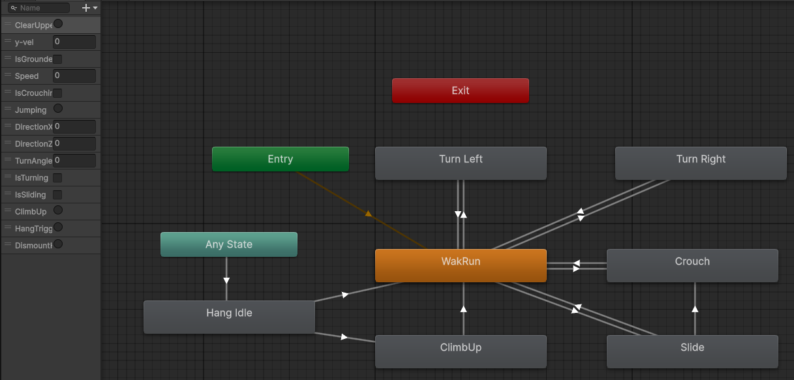
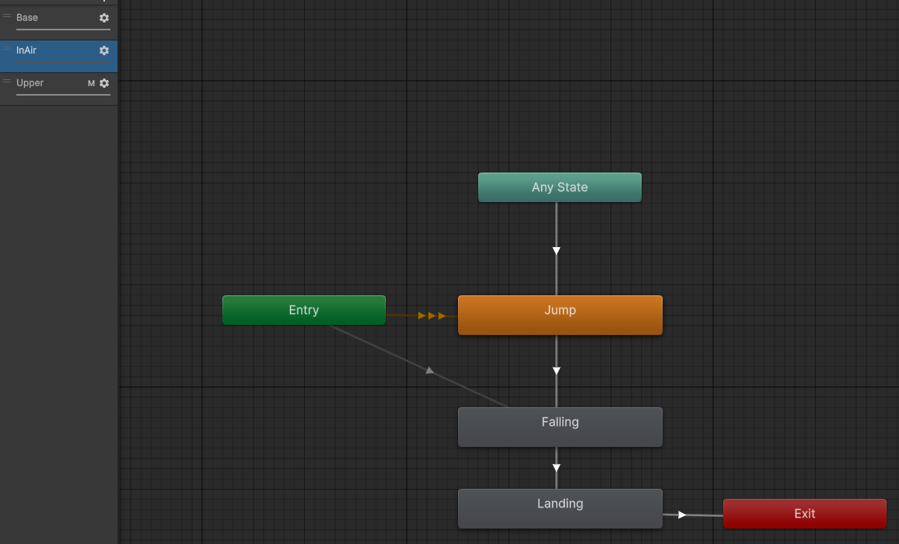
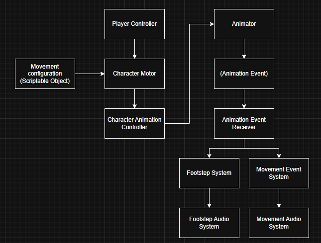
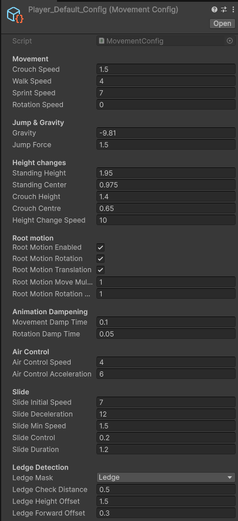

# Unity Animation & Character Controller

A Unity project focused on developing a modular third-person character movement and animation system. The project explores animation state management, blend trees, root motion, animation events, and clean gameplay architecture while maintaining a clear separation between movement logic, animation control, and audio systems.

---

## Gameplay Showcase

> **GIF:** Complete movement showcase (walk, run, sprint, jump, crouch, slide)

<p align="center">
    
</p>

---

## Overview

The goal of this project was to gain a deeper understanding of Unity's animation system while building a responsive and extensible character controller suitable for future gameplay projects.

Rather than creating a simple movement controller, the project focuses on structuring the animation pipeline so that each system has a single responsibility.

---

## Character Movement

Implemented movement features include:

- Walking
- Running
- Sprinting
- Jumping
- Landing
- Air movement
- Root motion support
- Configurable movement speeds

> **GIF:** Demonstration of locomotion and movement transitions

<p align="center">
    
</p>

---

## Animation System

Features include:

- Blend Trees
- Smooth animation transitions
- Jump and landing states
- Root motion
- Animator parameter management
- Animation Events

> **Screenshot:** Blend Tree transitions

<p align="center">
    
</p>

> **Screenshot:** Air layer transitions

<p align="center">
    
</p>

---

## Audio Systems

Animation Events trigger independent gameplay systems responsible for:

- Footstep audio
- Landing audio
- Movement effects

This keeps animation clips independent from gameplay implementation.

---

## Architecture

The project follows a modular architecture with each component responsible for a single area of functionality.

<p align="center">
    
</p>

```
Player Controller
        │
        ▼
Character Motor ◄──── MovementConfig (ScriptableObject)
        │
        ▼
Character Animation Controller
        │
        ▼
      Animator
        │
(Animation Events)
        ▼
Animation Event Receiver
      ├──────────────┐
      ▼              ▼
Footstep System   Movement Event System
      │              │
      ▼              ▼
Footstep Audio   Movement Audio
```

---

## Design Decisions

### Separation of Concerns

Movement, animation, configuration and audio are implemented as independent systems.

### Animation Events

Animation clips communicate through a dedicated Animation Event Receiver rather than directly invoking gameplay systems.

### ScriptableObjects

Movement values are stored inside a configurable ScriptableObject allowing movement tuning without changing source code.

> **Screenshot:** MovementConfig ScriptableObject

<p align="center">
    
</p>

---

## Technologies

- Unity
- C#
- Unity Animator
- Blend Trees
- Animation Events
- ScriptableObjects

---

## Skills Demonstrated

- Gameplay Programming
- Character Controllers
- Animation Systems
- Blend Trees
- Root Motion
- Animation Events
- Clean Architecture
- Separation of Concerns
- Data-Driven Design
- Object-Oriented Programming

---

## Future Improvements

- Layered animations
- IK foot placement
- Surface-based footsteps
- Climbing and vaulting
- Animation state behaviours
- Multiplayer synchronization

---

## Repository Structure

```text
Assets/
├── Animations/
├── Audio/
├── Scripts/
│   ├── Animation/
│   ├── Audio/
│   ├── Character/
│   ├── Config/
│   └── Input/
├── ScriptableObjects/
└── Prefabs/
```

---

## Learning Outcomes

This project reinforced the importance of designing gameplay systems with clear responsibilities and modular architecture. By separating movement, animation, configuration and animation-driven events into dedicated components, the resulting controller is significantly easier to extend and maintain than a monolithic implementation.